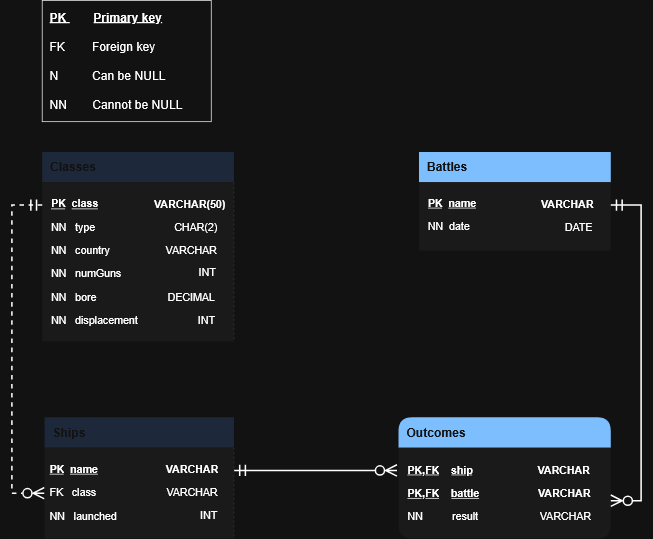

# Stage 5/6: Earliest Launch Dates
## Description
Now, let's delve deeper into the data regarding the ships and their countries of origin. The primary focus is  
on identifying the ships with the earliest launch dates for each respective country.

## Objectives
- Identify the `name` of the ship and `launched` date from the `Ships` table and the `country` where they were produced from the `Classes` table.  
- Ensure that the retrieved ships will be with the earliest launch dates for each respective country.  
- The column order is essential.` 
- Ensure that the results are sorted by `launched` dates in **ascending** order.  
- Use the `GROUP BY` clause and `JOIN` to solve the problem.

Take a look at the following database structure:



## Explanation of the database:  

The `**Classes**` table represents different categories of ships that participated in the World War II.  
    It stores information about each: **ship class**, including:
- `class`: the class name. It is the `primary key`.  
- `type`:type of ship represented as: battleship (`'bb'`) or battlecruiser (`'bc'`),  
- `country`: the country where the ship was built  
- `numGuns`: the number of main guns  
- `bore`: the gun caliber represented by the bore diameter in inches,  
- `displacement`: and the displacement (displacement) measured in weight tons.

The `**Ships**` table contains details about each ship, including:  
- `name`: the name of the ship. It is the `primary key`. 
- `class`: the class to which it belongs. It is the `foreign key` to category of ships defined in the Classes table.
- `launched`: and the year it was launched into the water.

The `**Battles**` table stores information about the various battles in which the ships participated during the World War II.  
    It includes:  
- `name`: the name of the battle. It is the `primary key`.
- `date`: the date on which the battle took place.

The `**Outcomes**` table provides data on the results of the ship's participation in each battle. It includes:  
- `name`: the name of the ship that took part in the battle  
- `batlle`: the name of the battle in which the ship participated  
- `result`: the result of the ship's involvement:
  - categorized as "sunk" if the ship was sunk during the battle,  
  - "damaged" if the ship was damaged during the battle,  
  - "OK" if the ship remained undamaged after the battle.

Table names are case-sensitive.

Click on the [link](WorldWarShips.sql) to download the SQL query for creating the database.

## Example

_Classes Table Example:_

| class    | type | country | numGuns | bore | displacement |
|----------|------|---------|---------|------|--------------|
| Yamagumo | bb   | Japan   | 10      | 15   | 50000        |
| Nagato   | bc   | Japan   | 12      | 16   | 50000        |
| Hood     | bb   | US      | 10      | 14   | 43000        |
| Bismarck | bb   | Germany | 8       | 14   | 40000        |
| Ise      | bc   | Japan   | 12      | 16   | 45000        |

From the table above, it can be counted that there are only three countries (`country`) listed, namely `Japan`, the `US`,  
and `Germany`. The next step involves identifying the earliest `launched` ships for each of these countries.

_Ships Table Example:_

| name         | class        | launched |
|--------------|--------------|----------|
| Yamagumo     | Yamashiro II | 1922     |
| Nagato       | Nagato       | 1916     |
| USS Caroline | Hood         | 1931     |
| Bismarck     | Bismarck II  | 1939     |
| Ise          | Ise          | 1928     |

From the data presented in the table above, it is evident that the ships (name) `Nagato`, `USS Caroline`, and `Bismarck`  
were `launched` the earliest for the corresponding countries of `Japan`, the `US`, and `Germany`. The output after  
identifying ship names with the earliest launch dates for each respective country:

| name         | launched | country |
|--------------|----------|---------|
| Nagato       | 1916     | Japan   |
| USS Caroline | 1931     | US      |
| Bismarck     | 1939     | Germany |


_From the output above, it can be seen that the order of the columns is `name`->`launched`->`country`_

## Query template:
```markdown
SELECT s.name, s.launched, c.country...;
```